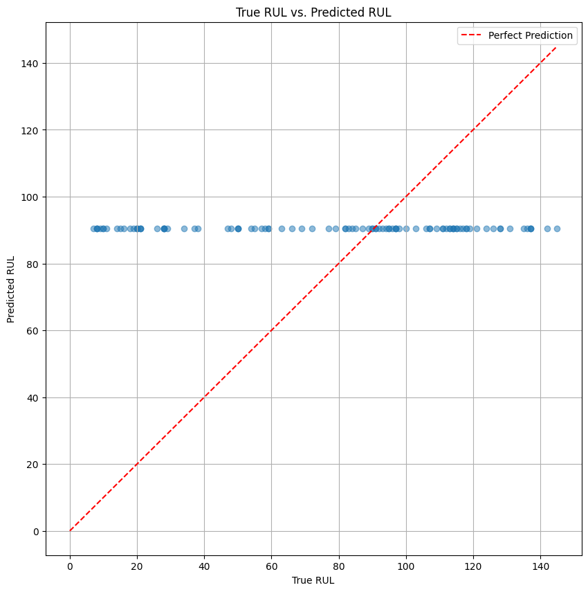

# Predictive Maintenance: Turbofan Engine RUL Prediction

This project uses a Long Short-Term Memory (LSTM) neural network to predict the **Remaining Useful Life (RUL)** of a NASA turbofan engine. It's a classic predictive maintenance (PdM) project built on time-series sensor data.

The goal is to perform a regression task: given a sequence of sensor readings from an engine, predict the number of remaining operational cycles before it fails.

## 📊 Dataset

This project uses the **NASA Turbofan Engine Degradation Dataset**, specifically the `FD001` subset.

* **Source:** [NASA C-MAPSS Jet Engine Simulated Data](https://data.nasa.gov/dataset/cmapss-jet-engine-simulated-data)
* **Files Used:**
    * `train_FD001.txt`: Time-series data for 100 engines, which run until failure.
    * `test_FD001.txt`: Time-series data for 100 engines, which stop at some point *before* failure.
    * `RUL_FD001.txt`: The "ground truth" RUL values for the 100 engines in the test set.

The data for each engine includes `21` sensor readings and `3` operational settings.

## ⚙️ Project Pipeline

The project was built in a Python notebook and follows these key steps:

1.  **Data Loading:** Loaded the `.txt` files into `pandas` DataFrames, assigning proper column names.
2.  **Preprocessing & Feature Engineering:**
    * Calculated the `RUL` (target variable) for the training data by finding the maximum cycle for each engine and subtracting the current cycle.
    * Scaled all 24 features (21 sensors + 3 settings) using `MinMaxScaler` (fit *only* on the training data) to normalize the data for the neural network.
3.  **Time-Series Sequence Generation:**
    * The data was transformed from a 2D table into 3D sequences for the LSTM.
    * A "look-back" window (or `SEQUENCE_LENGTH`) of **30 timesteps** was used.
    * This means the model looks at the last 30 cycles of sensor data to predict the RUL at the end of that sequence.
4.  **Model Architecture:**
    * A `TensorFlow/Keras` Sequential model was built.
    * The architecture consists of two stacked `LSTM` layers (`LSTM(64)` and `LSTM(32)`) with `Dropout` for regularization.
    * A final `Dense(1)` layer provides the single regression output (the predicted RUL).
5.  **Training:**
    * The model was compiled with the `Adam` optimizer and `mean_squared_error` (MSE) as the loss function.
    * It was trained for 25 epochs with a 20% validation split.

## 📈 Results

The trained model was evaluated on the unseen test set.

* **Mean Absolute Error (MAE): 14.86**
    * On average, the model's prediction for RUL is off by ~15 cycles.
* **Root Mean Squared Error (RMSE): 21.05**
    * A higher score that penalizes large errors, indicating the model occasionally makes predictions that are further off.

The plot below shows the `True RUL` from the test set vs. the `Predicted RUL` from the model. The strong positive correlation along the red "perfect prediction" line shows the model learned the degradation patterns successfully.


*(Note: You must have the `RUL_prediction_vs_true.png` file in your repository for this image to show up).*

## 🚀 How to Run

1.  **Clone the repository:**
    ```bash
    git clone [https://github.com/YOUR_USERNAME/YOUR_REPOSITORY_NAME.git](https://github.com/YOUR_USERNAME/YOUR_REPOSITORY_NAME.git)
    cd YOUR_REPOSITORY_NAME
    ```
2.  **Install dependencies:**
    It's recommended to use a virtual environment.
    ```bash
    pip install -r requirements.txt
    ```
3.  **Run the notebook:**
    Open and run the `.ipynb` notebook (e.g., in Google Colab or Jupyter Lab) to see the full process from data loading to evaluation.


